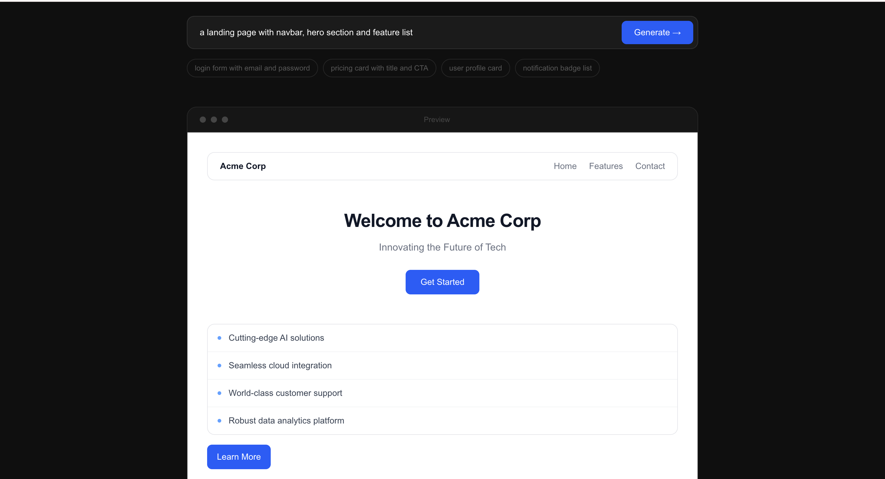
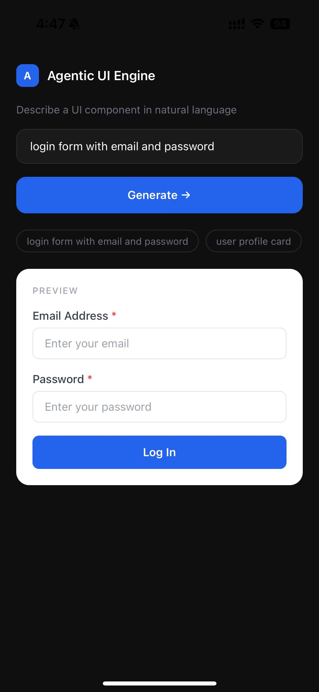
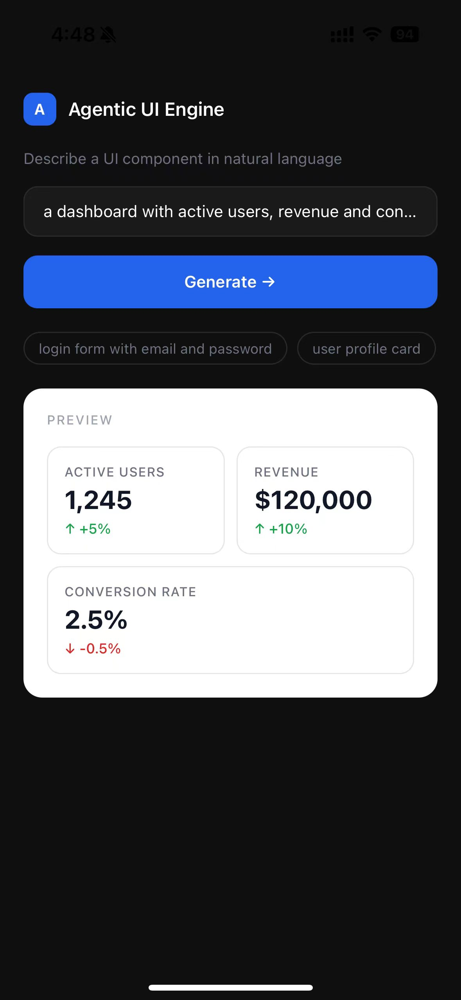

# Agentic UI Engine

Type a sentence. Get a working UI component.

**Live Demo → [agentic-ui-engine-web.vercel.app](https://agentic-ui-engine-web.vercel.app)**

## Screenshots

### Web


### Mobile (React Native)
| Login Form | Dashboard |
|-----------|-----------|
|  |  |

---

## Overview

Agentic UI Engine turns natural language into interactive React components. Describe what you want, and the system generates a live preview plus exportable code — powered by a custom Component DSL that maps AI output to real UI.

Generation isn't a single prompt-in, JSON-out call: each request goes through a small agent workflow — the request is decomposed into a component plan, the model can call a tool to check the user's past generations for something reusable, and the output is validated against the plan and repaired if anything's missing.

Built as a full-stack microservice project featuring AI-driven UI generation, cross-platform rendering, and a complete user system with persistent history.

## Features

- Natural language → rendered UI in ~5–10 seconds (simple requests are faster; complex ones that trigger history search and validation take longer — this is the trade-off of a multi-step agent pipeline vs. a single call)
- Task decomposition — requests are broken into an explicit component plan before generation, so multi-part asks (e.g. "a dashboard with stats, a table, and a login form") don't get lost in one big prompt
- Tool calling — the model can call search_component_history mid-generation to check the user's past generations for something similar, rather than generating a near-duplicate from scratch
- RAG-based history retrieval — history matching is semantic (OpenAI embeddings + cosine similarity), not keyword matching, so differently-worded but similar requests (e.g. "sign-in form" vs. "form to authenticate") still get matched
- Plan validation & repair — after generation, the output is checked against the component plan; anything missing triggers a targeted follow-up call to add just the missing pieces
- Interactive components — form validation, button actions, state management
- One-click code export (React + Tailwind)
- 13 component types: Button, Input, Card, List, Badge, Hero, Stat, Avatar, Divider, Table, Navbar, Alert, Progress
- User authentication with JWT (register, login, guest mode)
- Generation history saved per user
- Cross-platform — Web (Next.js) and Mobile (React Native / Expo)
- Microservice architecture: Node.js AI service + Spring Boot user service

## Stack

| | |
|---|---|
| Frontend | Next.js 14, TypeScript, Tailwind CSS |
| Mobile | Expo (React Native) |
| AI Service | Node.js, Express, OpenAI GPT-4o |
| User Service | Spring Boot 3.5, Java 21, JWT |
| Database | PostgreSQL, Spring Data JPA |
| Infra | Vercel (frontend) + Railway (backend + DB) |
| Testing | Jest, React Testing Library |
| CI/CD | GitHub Actions |

## How it works

The core is a Component DSL — a JSON schema designed to bridge natural language and rendered UI components. Generation runs as a short pipeline rather than one call:

```
Prompt
  → Plan (gpt-4o-mini decomposes the request into a component list)
  → Generate (gpt-4o, with a search_component_history tool it can call)
      → if called: embed query + past prompts, cosine-similarity match, feed results back
  → Validate against the plan, repair any missing components
  → Component DSL (JSON) → React / React Native
```

```json
{
  "components": [
    { "type": "input", "id": "email", "props": { "label": "Email", "required": true }},
    { "type": "button", "id": "submit", "props": { "label": "Sign in", "variant": "primary" }}
  ],
  "interactions": [
    { "trigger": "click", "sourceId": "submit", "action": "submit", "successMessage": "Welcome back!" }
  ]
}
```

The DSL separates concerns: AI handles semantics, the renderer handles presentation.

## Running locally

```bash
git clone https://github.com/jaaonline/agentic-ui-engine.git
cd agentic-ui-engine
npm install

# Node.js AI service
cp backend/.env.example backend/.env
# Add OPENAI_API_KEY to backend/.env
cd backend && npm run dev

# Spring Boot user service
cd java-backend
# Configure PostgreSQL in src/main/resources/application.properties
./mvnw spring-boot:run

# Frontend (new terminal)
cd apps/web && npm run dev

# Mobile (new terminal)
cd apps/mobile && npx expo start
```

## Structure

```
├── apps/
│   ├── web/          # Next.js frontend
│   └── mobile/       # Expo React Native app
├── backend/          # Node.js AI generation service
├── java-backend/     # Spring Boot user & history service
├── packages/shared/  # Shared types and hooks
└── .github/workflows # CI/CD pipeline
```

---

Made by [Josie Xiong](mailto:jaaonline8@gmail.com)